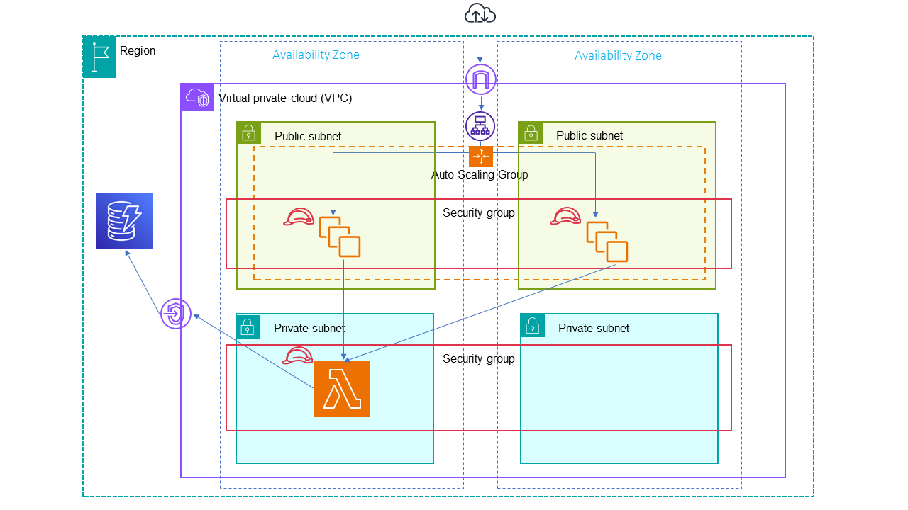

## Application Architecture

This document outlines the architecture of a web application built on Amazon Web Services (AWS). The application utilizes a three-tier architecture for separation of concerns and improved maintainability.

### Tiers

**1. Presentation Tier (Web Servers):**

* **Components:** Web servers (likely managed by an Auto Scaling Group and Application Load Balancer) reside in public subnets within a Virtual Private Cloud (VPC) and are accessible from the internet.
* **Responsibility:** This tier handles user interaction by serving static content (HTML, CSS, JavaScript) to users' browsers.

**2. Application Tier (Lambda as Backend):**

* **Components:** AWS Lambda functions act as the backend logic, running in private subnets within the VPC and not directly accessible from the internet.
* **Responsibility:** This tier processes user requests, performs business logic operations, interacts with the data tier (DynamoDB), and sends responses back to the web servers.

**3. Data Tier (DynamoDB):**

* **Components:** Amazon DynamoDB, a NoSQL database service, stores and manages the application's data. It is accessed through a DynamoDB Gateway Endpoint for secure communication within the VPC.
* **Responsibility:** This tier is responsible for data persistence, retrieval, and updates.

### Additional Components

* **VPC:** Provides a logically isolated network environment for the application's resources.
* **Subnets:** The VPC is divided into public and private subnets. Public subnets allow internet access, while private subnets restrict access to internal resources.
* **Security Groups:** Act as virtual firewalls that control inbound and outbound traffic for web servers and Lambda functions.
* **DynamoDB Gateway Endpoint:** Enables secure communication between Lambda functions (in private subnets) and the DynamoDB database.

### How it Works

1. A user interacts with the application through the web interface.
2. The web server receives the request and forwards it to the appropriate Lambda function via a security group rule allowing such communication.
3. The Lambda function processes the request, interacting with DynamoDB for data operations if necessary.
4. The Lambda function sends a response back to the web server.
5. The web server delivers the response to the user.

### Benefits of this Architecture

* **Scalability:** Each tier can be scaled independently to handle increased traffic or workload.
* **Security:** Private subnets for Lambda functions and secure endpoints for DynamoDB access enhance application security.
* **Cost-Effectiveness:** Lambda's serverless model allows for paying only for the compute time consumed, optimizing costs.
* **High Availability:** Multiple Availability Zones are used to ensure redundancy and resilience.
